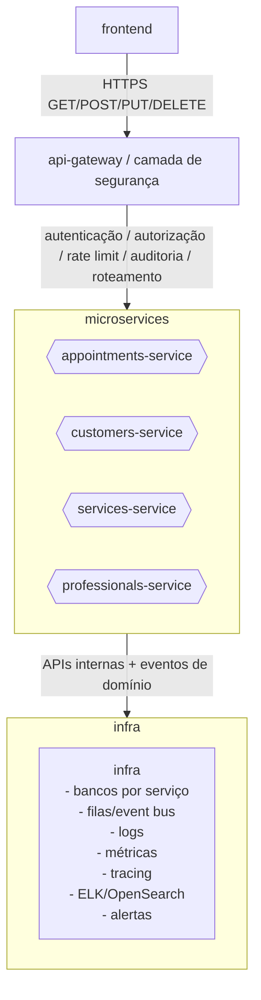

# Roadmap para microserviços independentes

Objetivo: evoluir o projeto de um monólito modular em NestJS para uma arquitetura de microserviços com vida própria, sem criar uma biblioteca compartilhada gigante que acople todos os serviços.

Desenho alvo:



Regra principal: cada microserviço deve conseguir evoluir, testar, publicar e trocar sua infraestrutura sem depender diretamente do código interno dos outros.

**1. Estado atual**

- Runtime principal em NestJS.
- Camada Express antiga removida.
- `apps/api` é o entrypoint HTTP principal.
- `apps/frontend/public` é a fronteira atual do frontend.
- `apps/appointments-service` existe como placeholder da primeira extração.
- `packages/domains/*` concentra domínio, validações, repositories e adapters por domínio.
- `packages/shared/common` concentra utilitários neutros.
- `packages/contracts` existe para contratos compartilháveis.

Esse estado ainda é monólito modular. Os pacotes ajudam a organizar a extração, mas não devem virar dependência obrigatória entre microserviços no longo prazo.

**2. Princípios de arquitetura**

- Microserviços não compartilham banco de dados no destino final.
- Microserviços não importam repositories, models Mongoose, queries SQL ou providers internos de outros serviços.
- O compartilhamento permitido deve ser pequeno e estável: contratos, nomes de eventos, schemas públicos e tipos simples.
- Regras de negócio pertencem ao serviço dono do domínio.
- Comunicação síncrona deve passar por APIs internas bem definidas.
- Comunicação assíncrona deve usar eventos de domínio.
- O gateway cuida de segurança, identidade, rate limit e roteamento externo.
- Observabilidade deve ser transversal: logs estruturados, métricas, tracing e correlação por request id.

**3. Próximo passo imediato: contratos**

Antes de extrair qualquer serviço, formalizar em `packages/contracts`:

- DTOs públicos de `appointments`;
- status permitidos de appointment;
- formatos de IDs e datas;
- eventos:
  - `appointment.created`;
  - `appointment.rescheduled`;
  - `appointment.cancelled`;
  - `appointment.completed`;
- payloads versionados para cada evento;
- erros públicos esperados, como conflito de agenda e entidade não encontrada.

Importante: `packages/contracts` não deve importar NestJS, Mongoose, `pg`, repositories ou código de infraestrutura.

**4. Separar domínio puro de infraestrutura**

Dentro dos pacotes atuais, separar melhor:

```text
packages/domains/appointment/
  rules/
  validation/
  contracts-adapters/
  infrastructure/
    mongo/
    postgres/
```

Meta:

- regras puras podem ser testadas sem banco;
- adapters Mongo/Postgres ficam isolados;
- controllers Nest continuam em `apps/api` ou `src/nest`;
- `appointments-service` poderá copiar ou assumir seu domínio sem carregar outros serviços junto.

**5. Criar o api-gateway**

Evoluir `apps/api` para papel de gateway:

- validar token OAuth/JWT;
- resolver usuário/tenant/permissões;
- aplicar rate limit;
- emitir `x-request-id` e contexto de auditoria;
- rotear chamadas para módulos locais ou serviços extraídos;
- padronizar respostas de erro.

No início, `apps/api` ainda pode chamar providers locais. Após extrações, passa a chamar HTTP interno, gRPC ou mensageria.

**6. Extrair primeiro: appointments-service**

Começar por appointments porque concentra as regras mais sensíveis:

- disponibilidade;
- conflito de horários;
- criação de appointment;
- reagendamento;
- cancelamento;
- conclusão;
- histórico.

Primeira versão sugerida:

```text
apps/appointments-service/
  server.js
  src/
    appointment.controller.js
    appointment.provider.js
    appointment.repository.js
    appointment.events.js
```

Esse serviço deve ter testes próprios e boot próprio.

Critério de pronto:

- sobe separado da API;
- possui health check próprio;
- tem banco ou schema próprio;
- publica eventos de domínio;
- não importa provider/controller/repository de `apps/api`;
- usa apenas `packages/contracts` e utilitários realmente neutros.

**7. Comunicação entre serviços**

Começar simples:

- Gateway -> appointments-service via REST interno.
- appointments-service consulta dados mínimos de customers/services/professionals por APIs internas quando necessário.

Depois evoluir:

- cache local de dados de leitura;
- eventos para sincronizar projeções;
- mensageria para fluxos assíncronos.

Evitar no início:

- transação distribuída;
- banco compartilhado;
- importar model/repository de outro serviço;
- chamada circular obrigatória entre serviços.

**8. Extrair services de suporte**

Depois que appointments-service estiver estável:

1. `customers-service`
2. `services-service`
3. `professionals-service`

Cada serviço deve possuir:

- API própria;
- banco/tabelas próprias;
- health check;
- testes próprios;
- logs e métricas;
- contratos públicos;
- eventos de alteração relevantes.

**9. Infraestrutura**

Preparar gradualmente:

- Dockerfile por app;
- docker-compose local com gateway, serviços, bancos e fila;
- migrations por serviço;
- CI rodando testes por app/pacote;
- deploy independente por serviço;
- logs estruturados centralizados;
- métricas com Prometheus/OpenTelemetry;
- tracing distribuído;
- ELK/OpenSearch para consulta de logs;
- alertas por erro, latência e indisponibilidade.

**10. Segurança**

Camada de segurança no gateway:

- OAuth2/OIDC ou JWT validado no gateway;
- propagação de identidade para serviços internos;
- autorização por escopo/permissão;
- rate limit por usuário/IP/tenant;
- CORS no gateway;
- auditoria de ações sensíveis.

Serviços internos também devem validar chamadas internas:

- token interno ou mTLS no futuro;
- checagem de escopos internos;
- rejeitar chamadas sem contexto de identidade quando necessário.

**11. O que evitar**

- Criar uma lib compartilhada com toda regra de negócio.
- Compartilhar model Mongoose ou entity SQL entre serviços.
- Fazer um serviço acessar diretamente o banco do outro.
- Fazer todos os serviços dependerem de `packages/domains/*`.
- Extrair todos os serviços ao mesmo tempo.
- Começar com mensageria complexa antes de estabilizar os contratos.

**12. Ordem recomendada**

1. Formalizar contratos em `packages/contracts`.
2. Separar domínio puro de infraestrutura em `packages/domains/appointment`.
3. Transformar `apps/api` em gateway de segurança/roteamento.
4. Criar boot real para `apps/appointments-service`.
5. Mover fluxo de appointments para o serviço novo.
6. Fazer gateway chamar appointments-service.
7. Adicionar eventos de domínio.
8. Separar banco/schema de appointments.
9. Adicionar observabilidade distribuída.
10. Só então extrair customers, services e professionals.

**13. Meta final**

Cada microserviço deve ter vida livre:

- deploy independente;
- banco próprio;
- testes próprios;
- contratos explícitos;
- observabilidade própria;
- regra de negócio local;
- dependência mínima de libs compartilhadas;
- integração com outros serviços por API/eventos, não por import interno.
